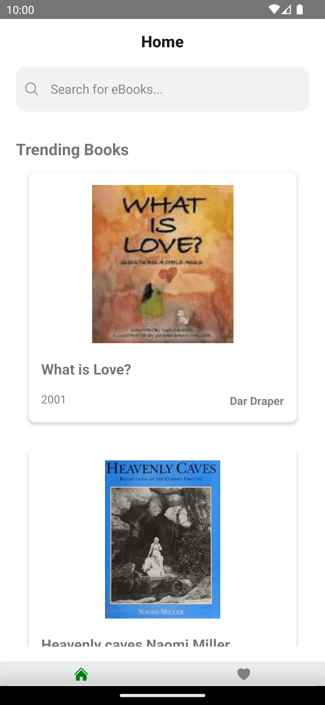

# BookLicious 🤖

## Overview 📚

**NOTE**: Certain APIs of OPENLIBRARY went PRIVATE. So I used other set of APIs from OPENLIBRARY for this project.

**Booklicious** is a feature-rich Book Library designed to streamline the process of fetching and storing trending books to your collection.

On **HomeScreen** User will see a list of trending books. User can also search bor a particular title by typing the **SearchBar** present at top, which will return the results below.

On tap of any book, User will be redirected to **DetailsScreen** where all the details about the book will be showcased. User can also save the book to favourites by clicking on **Heart** icon.

If User has added his favourite books, then it will be displayed in the **FavouritesScreen**

# Screenshots 😎

 

 

## Live Demo 👨‍💻

Explore the project on [GitHub](https://github.com/samarth4599/booklicious) or try out the live app by running the app. (npm run android)

## Dependencies ⚙️

- **_@react-native-community/netinfo_** - To check if internet is connected or not.
- **_react-native-fast-image_** - For fast and optimized image processing.
- **_react-native-heroicons_** - Beautiful Icons
- **_react-native-keychain_** - To securely store favourite books in memory.
- **_react-navigation_** - For Stack and Bottom navigations.
